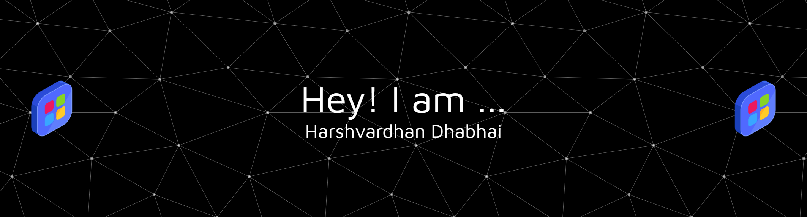

<!-- 🔥 Banner -->

  

---

  🚀 A Passionate Software Engineer | Tech Explorer | Problem Solver 🚀

  
  
  

---

### 👨‍💻 About Me
- 🔭 Working on **OpenCV Based Attendance System**  
- 🌱 Currently learning **Data Structures & Algorithms**  
- 👯 Looking to collaborate on **App Development Projects**  
- 🤝 Seeking guidance in **App Development**  
- 💬 Ask me about **C++ | Python | Web Development**  
- 📫 Reach me at **harshvardhandhabhai2004@gmail.com**  
- ⚡ Fun Fact: **Dreaming Big → FAANG within a year 😉**  

---

### 🌐 Connect with Me

  
  
  
  

---

### 🛠️ Languages and Tools

 
  

---

### 📊 GitHub Stats

  
  

  

---

## 🎧 Currently Vibing To

  

---

✨ “Code. Debug. Repeat. Success will follow.” ✨

